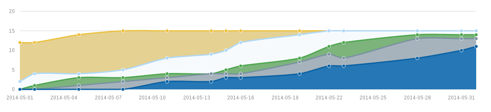

# 3-grunt-track-document-status

Given: A long markdown document which consists of multiple sections, where each section has an editing status (ToDo, InProgress, InReview, Done). 
This examples aggregates the status of all sections into a table and visualizes the table with a cumulative flow diagram.  

## Install dependencies
Go to the example directory and type:

    npm install

## Build via grunt
You can either install grunt globally

    npm install -g grunt-cli

or use the local grunt installation at node_modules/grunt-cli/bin/grunt
To build the html file, just type

    grunt

## How it works
Gruntfile.js calls a custom grunt task 'update_status_table', defined in tasks/update_status_table.js.
This task processes the main.md file and writes the updated table back to that file.
If main.md hasn't a status table yet, a new one is inserted at the beginning of the file.
The five statuses (TODO, IN_PROGRESS, TO_REVIEW_1, TO_REVIEW_2, DONE) are currently hardcoded.

The status table looks like this:

!!!!!

| Datum      |TODO |IN_PROGRESS|TO_REVIEW_1|TO_REVIEW_2|DONE|
| :---------:|:---:|:---------:|:---------:|:---------:|:--:|
| 2014-05-23 | 0   | 3         | 4         | 2         | 6  |
| 2014-05-28 | 0   | 1         | 1         | 5         | 8  |
| 2014-05-31 | 0   | 1         | 1         | 3         | 10 |
| 2014-06-01 | 0  | 1         | 1       | 2  | 11  |
!!!!!

In the next step Gruntfile.js converts main.md to html (output/main.html). 
This file includes the file js/statusdiagram.js which parses the table and creates a cumulative flow diagram from it.

